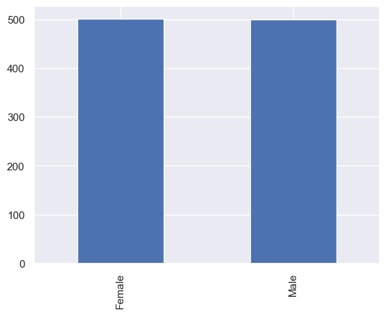
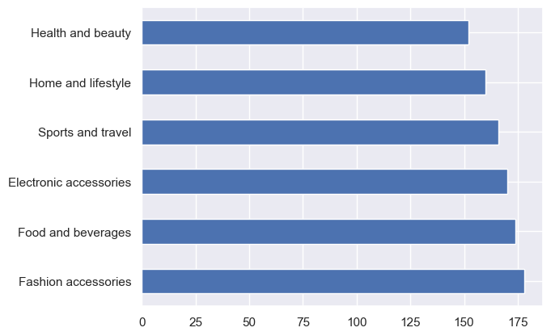
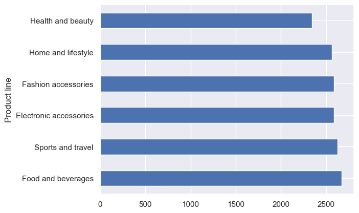
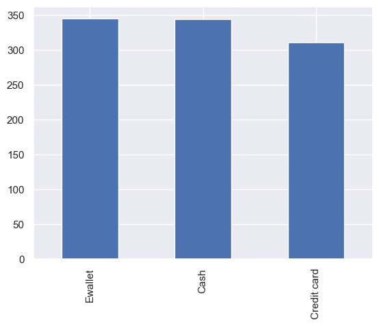
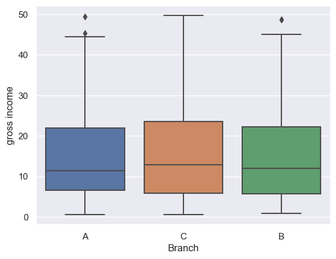
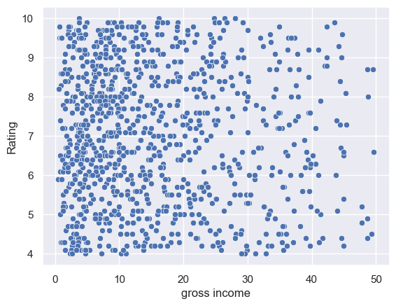
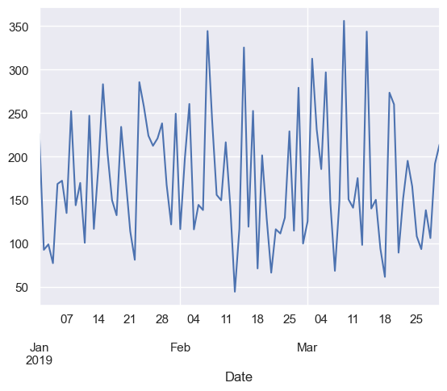
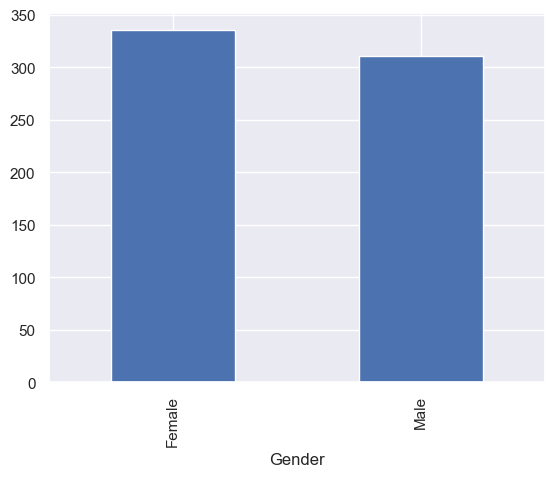
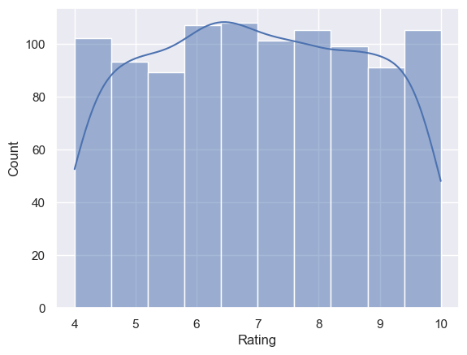

# Supermarket Sales Analysis

This project aims to analyze historical sales data of a supermarket company. The dataset includes sales records from 3 different branches over a period of 3 months. Predictive data analytics methods can be applied to this dataset for various insights.

## Table of Contents
1. [Introduction](#introduction)
2. [Dataset Overview](#dataset-overview)
3. [Data Exploration](#data-exploration)
4. [Analysis](#analysis)
   - [Who makes more purchases?](#question-1-who-makes-more-purchases)
   - [Which product line is the most popular?](#question-2-which-product-line-is-the-most-popular)
   - [Gross income for each product line?](#question-3-gross-income-for-each-product-line)
   - [The most popular payment method?](#question-4-the-most-popular-payment-method)
   - [Gross income distribution by branch?](#question-5-gross-income-distribution-by-branch)
   - [Relationship between gross income and rating?](#question-6-relationship-between-gross-income-and-rating)
   - [Variation of gross income over time?](#question-7-variation-of-gross-income-over-time)
   - [Average purchase amount by gender?](#question-8-average-purchase-amount-by-gender)
   - [Distribution of ratings given by customers?](#question-9-distribution-of-ratings-given-by-customers)
5. [Conclusion](#conclusion)
6. [Future Work](#future-work)

## Introduction 

The growth of supermarkets in most populated cities is increasing, leading to high market competition. This dataset provides insights into sales trends, customer behavior, and popular products.

## Dataset Overview 

The dataset consists of the following columns:
- **Invoice id:** Computer-generated sales slip invoice identification number
- **Branch:** Branch of supercenter (identified by A, B, and C)
- **City:** Location of supercenters
- **Customer type:** Type of customers (Members or Normal)
- **Gender:** Gender of customer
- **Product line:** General item categorization groups
- **Unit price:** Price of each product in $
- **Quantity:** Number of products purchased
- **Tax:** 5% tax fee for customer buying
- **Total:** Total price including tax
- **Date:** Date of purchase (January 2019 to March 2019)
- **Time:** Purchase time (10am to 9pm)
- **Payment:** Payment method used (Cash, Credit card, or Ewallet)
- **COGS:** Cost of goods sold
- **Gross margin percentage:** Gross margin percentage
- **Gross income:** Gross income
- **Rating:** Customer stratification rating on their overall shopping experience (On a scale of 1 to 10)

The dataset can be found [here](https://www.kaggle.com/datasets/aungpyaeap/supermarket-sales).

## Data Exploration 

The dataset was explored to understand its structure and characteristics. Data cleaning steps were performed to handle missing values and duplicates.

## Analysis 

### Question 1: Who makes more purchases? 

Here we see that females make slightly more purchases than males.

### Question 2: Which product line is the most popular? 

The most popular product line is Fashion accessories.

### Question 3: Gross income for each product line? 

Food and Beverage bring in the most income.

### Question 4: The most popular payment method? 

Insight: *The most popular payment method varies depending on the dataset.*

### Question 5: Gross income distribution by branch? 

Insight: *The gross income distribution across branches can help identify which branches are performing better in terms of revenue generation.*

### Question 6: Relationship between gross income and rating? 

Insight: *There appears to be a positive relationship between gross income and customer rating, suggesting that higher-rated purchases contribute to higher gross income.*

### Question 7: Variation of gross income over time? 

Insight: *The variation of gross income over time can provide insights into seasonal trends and fluctuations in sales.*

### Question 8: Average purchase amount by gender? 

Insight: *Understanding the average purchase amount by gender can help tailor marketing strategies and promotions to specific customer segments.*

### Question 9: Distribution of ratings given by customers? 

Insight: *Analyzing the distribution of ratings given by customers can provide insights into overall customer satisfaction and identify areas for improvement.*

## Conclusion 

In conclusion, this analysis provides valuable insights into the supermarket sales data, including customer preferences, popular products, revenue generation, and various relationships within the data. Understanding these insights can help in making informed business decisions to optimize sales strategies, improve inventory management, enhance customer satisfaction, and ultimately drive profitability. By leveraging the information obtained from this analysis, supermarket companies can tailor their marketing efforts, streamline their product offerings, and implement targeted promotional campaigns to attract more customers and increase sales.

Additionally, identifying trends and patterns within the data can enable supermarkets to forecast demand more accurately, allocate resources efficiently, and mitigate risks associated with fluctuating market conditions. Overall, the comprehensive analysis of supermarket sales data empowers businesses to stay competitive in the dynamic retail landscape and adapt to evolving consumer preferences effectively.
